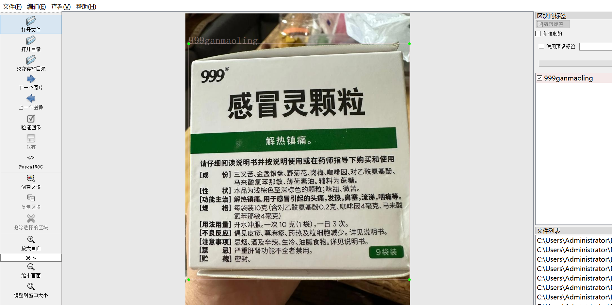
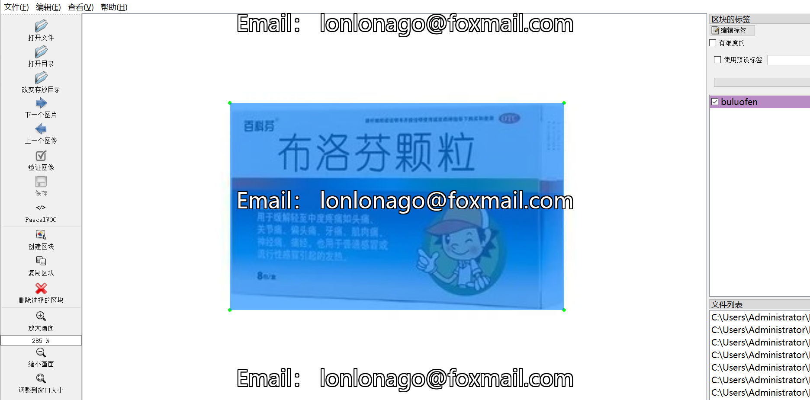
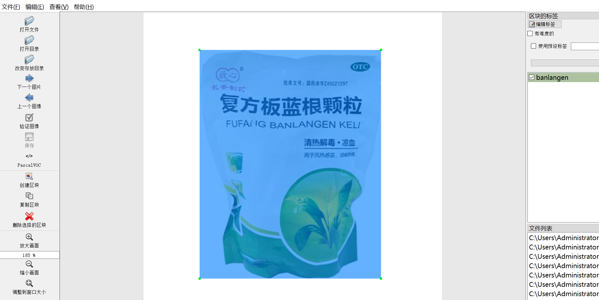
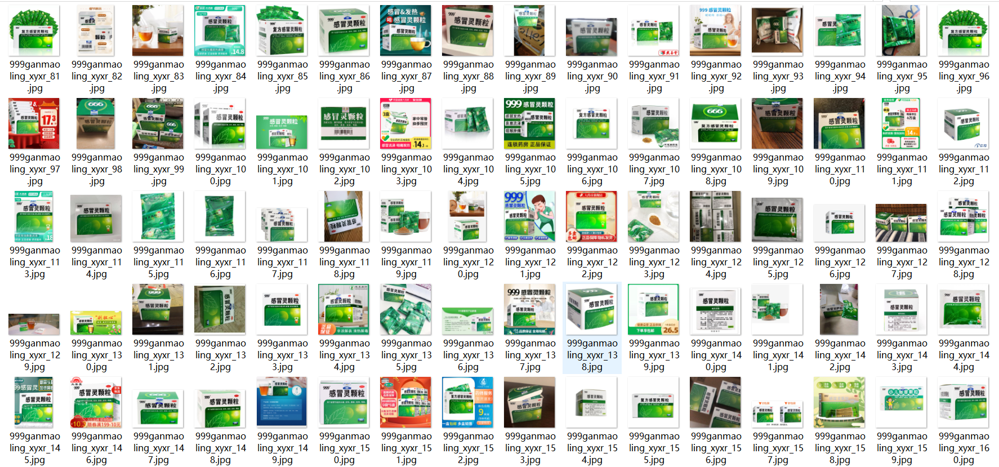

# [Object Detection Dataset] Cold Medicine Classification Detection Dataset: 959 Images, 3-class VOC+YOLO format

Cold medicines are used to alleviate symptoms of the common cold, encompassing a wide variety of categories including traditional Chinese medicine, Western medicine combined with Chinese herbal medicine, and pharmaceutical drugs. Below is a brief introduction to cold medicines:

Types: Common cold medicines include compound Aspirin and Acetaminophen Granules, 999 Cold Ling, etc. These medications differ in their ingredients and effects, suitable for different types of colds.

Actions: The main functions of cold medicines include reducing fever, alleviating pain, antihistamine, inhibiting cough, and muscle relaxant. For example, Paracetamol can suppress the central thermoregulatory center, reducing fever response; antihistamine drugs can relieve allergies and symptoms such as nasal congestion.

Use Instructions: When choosing and using cold medicines, follow the doctor's advice and medication instructions, paying attention to dosage and time of use. Overuse or improper use of medication may lead to adverse reactions and risks, such as liver damage, rashes, etc.

Target Populations: Cold medicines are important for relieving cold symptoms, but they should be selected and used according to the condition and physical condition of the patient, following medical advice.

In summary, cold medicines are crucial in alleviating symptoms of the common cold, but it is necessary to choose the appropriate drug based on the condition and body condition, and follow medical advice and medication instructions.

Today, we introduce the 【Target Detection Dataset】Cold Medicine Classification Detection Dataset: 959 Images, 3-class VOC+YOLO format

Dataset format: Pascal VOC format + YOLO format (without split path txt file, only containing jpg images and corresponding VOC format xml files and yolo format txt files)

Number of image files (jpg files): 960a

Number of annotation files (xml files): 960

Number of annotation files (txt files): 960

Number of annotation categories: ["999ganmaoling", "banlangen", "buluofen", "drugs"]

Number of bounding boxes per category:

"999ganmaoling" = 573

"banlangen" = 134

"buluofen" = 657

"drugs" = 1

Total number of bounding boxes: 1365

Using annotation tool: labelImg

Annotation rules: drawing a rectangle box for each category

Important note: The images were collected from web scraping and self-organized annotations, original content, please do not redistribute without permission.

Example of annotation:

## Images

---

Here is a pay link on Stripe (https://buy.stripe.com/3cs8yP7sY87d0vu9AB). Please contact me lonlonago@foxmail.com after funding $89, and I will send you a complete data files, thank you!

